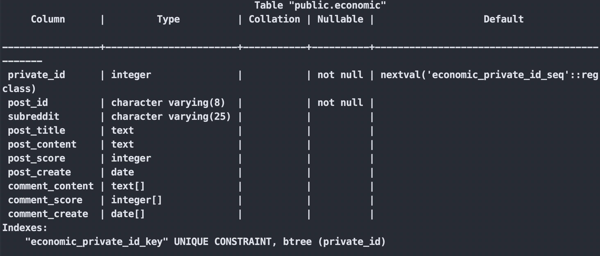

# Reddit Data Preprocessing and PostgreSQL integration

This project processes and cleans Reddit data, which is organized by month and stored in `.zst` compressed format. The data is then decompressed, cleaned, and filtered based on popular subreddits in Politics, Sports, and Economics. After cleaning the data, it is uploaded to a PostgreSQL database for further analysis.

## Project Components

### `decompress.py`

This script handles the decompression and cleaning of Reddit data. It extracts submissions and comments from `.zst` files, filters by specific subreddits, and outputs cleaned CSV files for each category.

### `psql_connect.py`

This script connects to a PostgreSQL database and uploads the cleaned data from CSV files into the database. It integrates the submissions and comments data, performs a left join by `post_id`, and uploads them into the PostgreSQL tables.

## Features

### Comment and Submission File

- Comment File contains the following attributes:

  - `link_id`, `created_utc`, `body`, `score`

- Submission File contains the following attributes:
  - `id`, `subreddit`, `title`, `selftext`, `score`, `created_utc`

### Filtered by Popular Subreddits

The data is filtered by subreddit categories in Politics, Sports, and Economics:

#### Politics

- `politics`, `PoliticalDiscussion`, `unpopularopinion`, `Conservative`, `PoliticalHumor`

#### Sports

- `nba`, `sports`, `nfl`, `PremierLeague`, `formula1`

#### Economics

- `Economics`, `AskEconomics`, `inflation`, `economicCollapse`, `badeconomics`

The output includes three separate CSV files saved in the `decompress` directory:

- `*-politics.csv`
- `*-sports.csv`
- `*-economics.csv`

## Process Overview

### Step 1: Decompress and Clean Data (`decompress.py`)

1. **Decompress `.zst` files**: It reads and decompresses the `.zst` files that contain Reddit data.
2. **Clean Data**: It filters the data based on the selected subreddits and removes unnecessary content like URLs and non-alphanumeric characters from post and comment content.
3. **Write Cleaned Data**: The cleaned data is written into separate CSV files for Politics, Sports, and Economics.

To run the decompress.py script(The input can include multiple `.zst` files or directories:):

```bash
python3 decompress.py *.zst
```

```bash
python3 decompress.py */
```

Ensure your input files are in `.zst` format and contain Reddit data structured by month for accurate processing.

### Step 2: Upload Data to PostgreSQL (`psql_connect.py`)

1. **Create Tables**: It creates tables for the data in PostgreSQL.
2. **Upload Data**: The cleaned CSV files are uploaded to PostgreSQL using the COPY command.
3. **Join Data**: The comments data is aggregated and joined with the submission data using `post_id` to create a comprehensive dataset.

To run the psql_connect.py script, execute the following command:

```bash
python3 psql_connect.py
```

You will be prompted to enter the following details:

- **Database Name**: The name of your PostgreSQL database.
- **User**: Your PostgreSQL username.
- **Password**: Your PostgreSQL password.
- **Host**: The host of your PostgreSQL server.
- **Port**: The port number for the PostgreSQL server.
- **Target Table Name**: The name of the table where data will be uploaded.
- **Post Path**: The path to your cleaned submissions CSV file.
- **Comment Path**: The path to your cleaned comments CSV file.

Once the script runs, the data will be integrated and uploaded to the specified PostgreSQL database.


### Prerequisites

Install the required Python package:

```bash
pip3 install zstandard psycopg2
```
